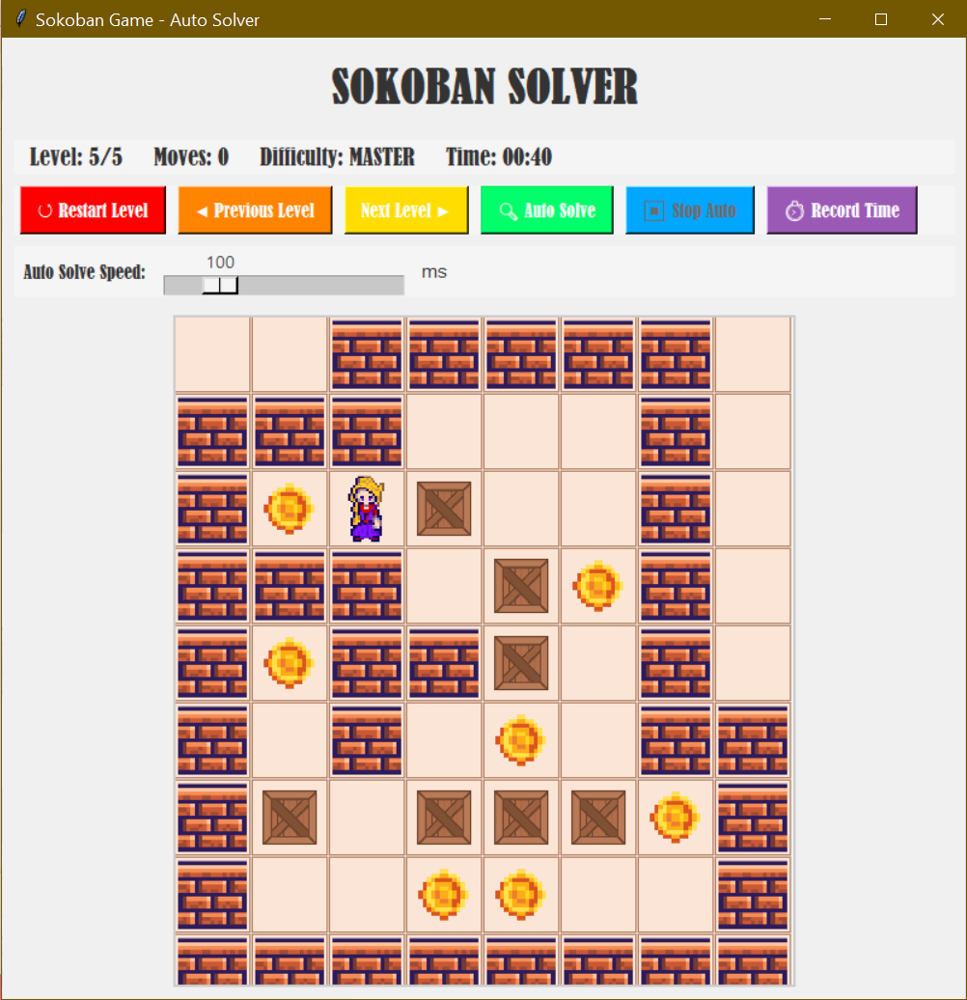

# Sokoban AI Solver

Artificial Intelligence course project that implements the classic Sokoban puzzle game with an automatic solver based on the **A* Search Algorithm**.

---

## Gameplay Screenshot



---

## Project Overview

Sokoban is a puzzle game where the player must push boxes onto designated target locations while avoiding deadlock situations.

This project combines Artificial Intelligence techniques with an interactive graphical interface to provide both manual gameplay and automatic solving capabilities.

---

## Features

* Multiple game levels with increasing difficulty
* Interactive graphical user interface (GUI)
* Manual keyboard controls
* Automatic solver using A* Search
* Manhattan Distance heuristic
* Deadlock detection mechanisms
* Adjustable auto-solver speed
* Move counter
* Real-time timer
* Level navigation (Next, Previous, Restart)

---

## Technologies Used

* Python
* Tkinter
* Pillow (PIL)
* Object-Oriented Programming (OOP)

---

## Project Structure

```text
Sokoban-AI-Solver/
│
├── Assets/
│   ├── gameplay.png
│   ├── wall.png
│   ├── floor.png
│   ├── player.png
│   ├── box.png
│   └── goal.png
│
├── Code/
│   └── SOKOBAN.py
│
├── Presentation/
│   └── sokoban.pptx
│
├── Report/
│   └── sokoban.pdf
│
└── README.md
```

---

## AI Concepts Implemented

### A* Search Algorithm

The solver evaluates states using:

**f(n) = g(n) + h(n)**

Where:

* **g(n)** = Cost of reaching the current state
* **h(n)** = Estimated distance to the goal state

### Heuristic Function

The solver uses the **Manhattan Distance** heuristic to estimate the remaining distance between boxes and target positions.

### Deadlock Detection

To improve efficiency, the solver detects unsolvable situations such as:

* Corner deadlocks
* Adjacent-box deadlocks
* Corridor deadlocks

This reduces unnecessary exploration and improves search performance.

---

## How to Run

### Install Dependencies

```bash
pip install Pillow
```

### Run the Game

```bash
python SOKOBAN.py
```

---

## Course Information

**Course:** Intelligent Search Algorithms (ISA)

**Project:** Sokoban Auto Solver

---

## Author

**Shimaa Sadeq**

---

## Future Improvements

* Implement IDA* Search
* Improve deadlock detection techniques
* Add additional game levels
* Compare multiple AI search algorithms
* Explore Reinforcement Learning approaches
